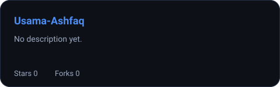
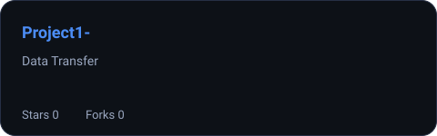
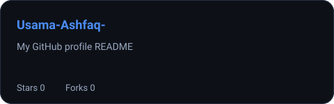
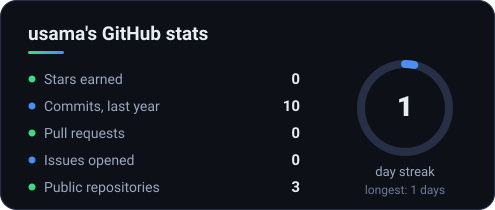
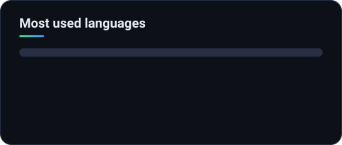

<div align="center">



<a href="https://github.com/Izhamalik/Izhamalik">
  
</a>

<br/>

[](https://www.linkedin.com/in/izharmalik923)
[](https://drive.google.com/file/d/1A1T3vHyiW3OBz5CYg_eNn2RayQcLYyjx/view?usp=drivesdk)
[](https://linktr.ee/izharmalik)
[](https://twitter.com/ZariMalikk)


</div>


## About me

I'm an Android engineer who enjoys turning ideas into fast, polished, maintainable apps. I currently lead the Android team at **Technest.pk**, where I mix hands-on development with mentoring, code reviews, and architecture decisions.

```kotlin
object IzharMalik : Developer {
    override val role      = "Team Lead, Android Development @ Technest.pk"
    override val languages = listOf("Kotlin", "Java")
    override val ui        = "Jetpack Compose"
    override val focus     = listOf("Scalable apps", "Clean code", "Great UX")
    override val mindset   = "Always learning, always shipping"
}
```

- Android apps built with **Kotlin, Java, and Jetpack Compose**
- Focused on scalable, user-friendly mobile products
- Leading student societies, running workshops, and giving back to the community


## Career path




## Tech stack

<!-- Edit freely. Remove any badge for tools you don't use, add ones you do. -->

**Languages**  


**Android**  


**Architecture and libraries**  


**Backend, data, and tools**  


## Awards and recognition


## Featured projects

<!-- Filled automatically from your pinned repositories. Pin your best repos on your profile to control what shows here. -->

<div align="center">

<!--PROJECTS:START-->
<a href="https://github.com/usama-cmd/Usama-Ashfaq"></a>
<a href="https://github.com/usama-cmd/Project1-"></a>
<a href="https://github.com/usama-cmd/Usama-Ashfaq-"></a>
<!--PROJECTS:END-->

</div>


## GitHub activity

<div align="center">




<picture>
  <source media="(prefers-color-scheme: dark)" srcset="https://raw.githubusercontent.com/Izhamalik/Izhamalik/output/github-snake-dark.svg"/>
  <source media="(prefers-color-scheme: light)" srcset="https://raw.githubusercontent.com/Izhamalik/Izhamalik/output/github-snake.svg"/>
  
</picture>

</div>


## Let's connect

I'm always happy to talk about Android, mobile architecture, mentoring, or new opportunities.

<div align="center">

[](https://www.linkedin.com/in/izharmalik923)
[](https://twitter.com/ZariMalikk)
[](https://linktr.ee/izharmalik)


</div>
